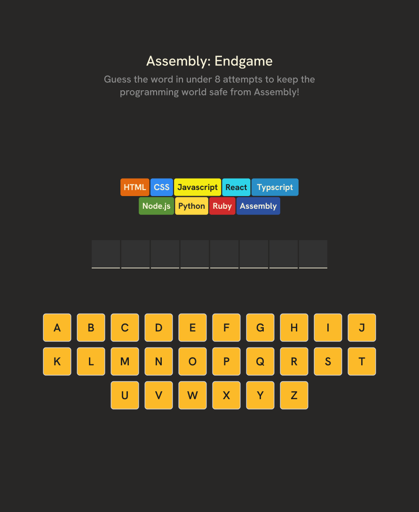
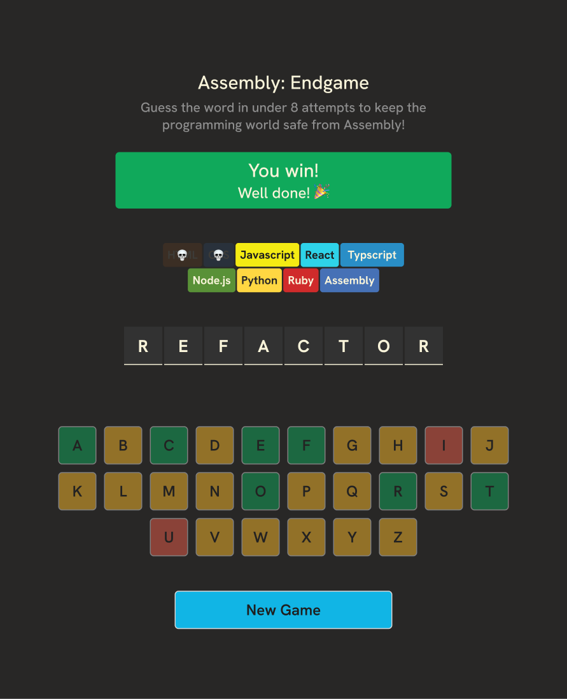
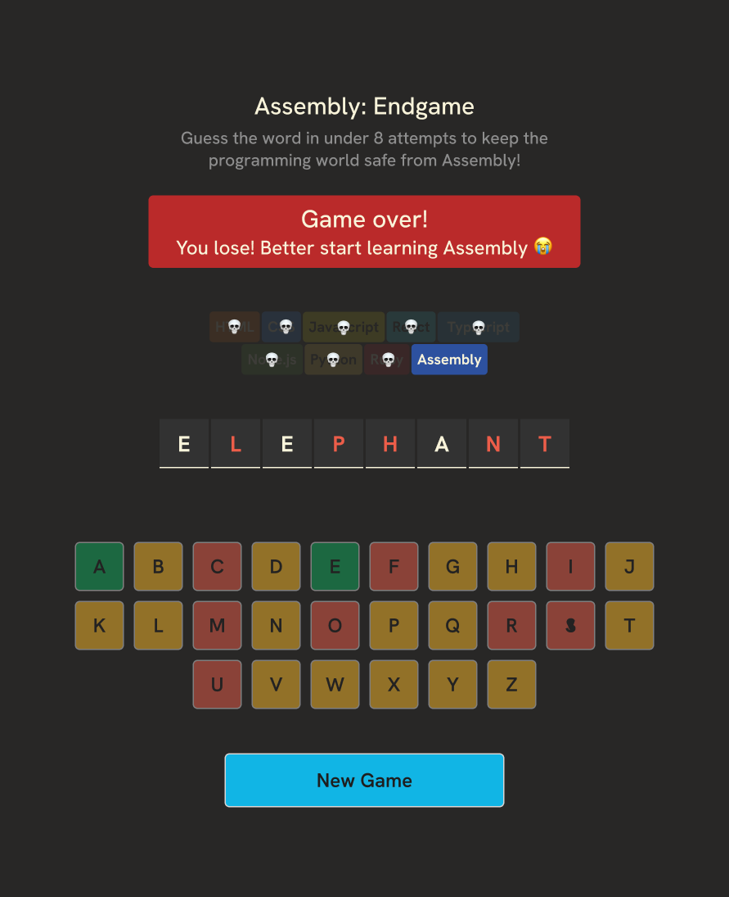

# Assembly-Endgame

## Overview

Assembly-Endgame is a word guessing game where you need to guess the word in under 9 attempts to keep the programming world safe from Assembly!

## Features

- Random word selection
- Letter guessing
- Life tracking
- Win and lose conditions
- Option to start a new game

## Screenshots

### Game Start



### Game Won



### Game Over



## Installation

1. Clone the repository:

    ```bash
    git clone https://github.com/yourusername/Assembly-Endgame.git
    ```

2. Navigate to the project directory:

    ```bash
    cd Assembly-Endgame
    ```

3. Navigate to the `assembly` directory:

    ```bash
    cd assembly
    ```

4. Install dependencies:

    ```bash
    npm install
    ```

## Usage

1. Start the development server:

    ```bash
    npm run dev
    ```

2. Open your browser and navigate to `http://localhost:5173/`.

## Contributing

Contributions are welcome! Please open an issue or submit a pull request for any changes.

## License

This project is licensed under the MIT License.
